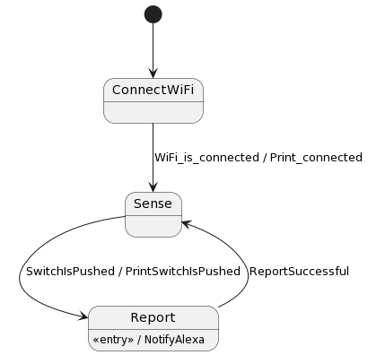
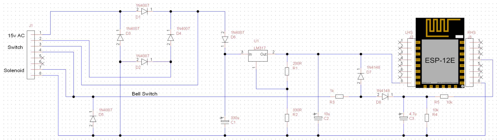
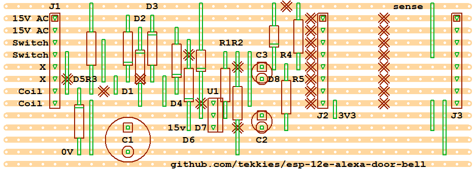

# esp-12e-alexa-door-bell

Announce the doorbell on Alexa using ESP-12E WiFi module from a 15V AC or DC power supply.

## Software Design

Code generated using [FloHsm by tzijnge](https://github.com/tzijnge/FloHsm)

## LED States
``_ _ _ _`` WiFi Connecting

``. . . .`` Sensing

``_______`` Report

## Circuit Design

## Board Layout

## Power Supply Design
 

# Development
* Generate FSM template code
  * `` docker run -v $(pwd):/run tekkiesuk/flohsm:latest fsm.plantuml``
    * A couple or warnings is normal
* Build binary in Arduino Studio

 # Credits
Built standing on the shoulders of these giants:
 - [LTspice](https://www.analog.com/en/design-center/design-tools-and-calculators/ltspice-simulator.html)
 - [TinyCAD by matt123p](https://github.com/matt123p/TinyCAD)
 - [VeeCAD by Roger Lascelles](http://veecad.com)
 - [FloHsm by tzijnge](https://github.com/tzijnge/FloHsm)
